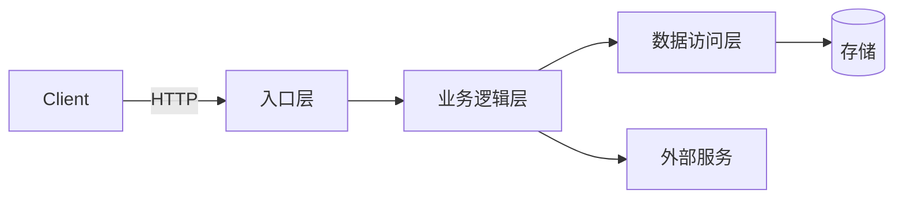

# open-understand — 代码理解

当变更涉及**已有代码**时，先对目标模块进行系统化代码理解，产出 `code-map.md`。帮助不熟悉老业务的程序员快速建立起对代码的心智模型。

## ⚡ 技能激活确认（必须执行）

你的第一条回复**必须输出**以下单行确认：

```
[open-understand v3.0 | <项目类型> | 模块: <目标模块/功能> | 增量: ✅已有code-map/❌首次] 开始代码理解
```

输出此确认后，继续执行后续步骤。

## 前置

### 接受哪些输入

- 一个功能模块名（如"用户登录"、"订单导出"）
- 一个需求描述（AI 从中提取涉及模块）
- 一个或多个文件路径（直接指定入口文件）

### 执行要求

- 所有结论必须附代码出处（文件路径 + 行号）
- 产出独立于 spec.md 的 `code-map.md`，放在 `ai-work/changes/<变更名>/` 下
- 如果尚无 ai-work/changes/ 目录，放在 `ai-work/` 目录
- **根据检测到的项目类型，选择对应的层名、术语和模板示例**

---

## 执行步骤

### Step 1: 快速扫描 + 语言检测 + 增量判断

1. 检测项目类型（复用 open-setup 的检测逻辑）
2. 执行 `tree -d -L 3`，建立整体目录感
3. 定位目标模块的核心目录结构
4. **增量检查**：如果已存在 `code-map.md`，读取"附-1 文件指纹"表，对比目标模块文件的当前修改时间（`git log -1 --format=%ai -- <file>`）。仅对**有变更的文件**重新执行 Step 2-8，未变更的文件复用已有分析结果

### Step 1.5: 架构模式识别

基于 Step 1 的目录结构和 `project-rules.md`，识别目标模块使用的**架构模式**：

- 分层架构（Layered）/ 六边形架构（Hexagonal）/ CQRS / 事件驱动 / MVC / MVVM / 其他
- 记录模式的核心约束（如分层架构要求"只允许上层调用下层，不允许反向引用"）
- 此识别结果写入 code-map.md §3 架构概览，后续 open-spec 的架构约束章节引用

### Step 2: 骨架提取（声明优先）

在深入追踪调用链之前，先对目标模块的每个核心文件提取**函数/类声明清单**，建立"文件 × 函数"矩阵。

**执行方式**：
1. 对模块内每个核心文件，搜索函数/类/接口声明（根据语言使用对应关键词：`function`/`def`/`class`/`func`/`interface`/`struct`/`impl` 等）
2. 记录每个声明的：文件路径、名称、行号、签名（参数+返回值）
3. 产出一个声明清单表：

```
| 文件 | 声明类型 | 名称 | 行号 | 签名 |
|------|---------|------|------|------|
| UserService.java | method | register | L15 | (RegisterDTO) → User |
| UserService.java | method | login | L45 | (String email, String pwd) → Token |
| UserDao.java | interface | findByEmail | L12 | (String) → Optional<User> |
```

4. 此清单在后续 Step 3 调用链追踪时用于**交叉验证**：
   - 调用链覆盖了哪些函数 ✅
   - 哪些函数不在任何调用链上 ⚠️（可能是死代码、独立入口、或遗漏的链路）

### Step 3: 全链路追踪（由外到内）

从**入口层**开始，逐层向内追踪到**存储层**。读取 `ai-work/rules/project-rules.md` 获取当前项目的层名（入口层/业务层/数据访问层）。

**通用追踪模式（用 project-rules.md 中的实际层名替换）**：

```
入口层 (Controller / Route / Page / Handler)
  ↘ 校验/中间件 (Validator / Guard / Middleware)
    ↘ 业务逻辑层 (Service / UseCase / Hook / Store)
      ↘ 外部依赖调用 (External API / 其他模块)
        ↘ 数据访问层 (DAO / Repository / API Client / Model)
          ↘ 存储 (DB / Cache / 外部服务)
```

对于每个节点，记录：文件路径、函数/方法签名、核心逻辑摘要、行号。

**业务规则提取**：在追踪过程中，识别代码中隐含的业务规则（如校验逻辑、状态流转条件、金额计算规则、权限检查），记录到 code-map.md §4.5 业务规则清单。这些规则是后续写 spec 的关键输入。

**搜索入口的方式**：根据 `ai-work/rules/project-rules.md` 中的项目类型和框架，搜索对应的路由/入口注解或配置（如 Java 搜 `@RequestMapping`，Python 搜 `@router.get`，前端搜路由配置文件等）。

### Step 4: 依赖关系追踪（上下游）

对 Step 3 中发现的每个核心函数/模型，**双向追踪依赖关系**：

- **下游（我调用谁）**: 目标函数直接调用的所有函数，记录关系类型（方法调用/接口实现/事件触发）
- **上游（谁调用我）**: 反向搜索所有调用目标函数的地方，记录入口路径和影响范围
- **跨文件 Import**: 目标模块的文件间 import/依赖关系
- **配置引用**: 哪些配置项控制这个行为

输出格式见 code-map.md §8 依赖关系图（3 张结构化表格 + 可选 Mermaid 图）。

### Step 5: 变更耦合分析

使用 `git log` 分析目标文件的历史变更模式（语言无关）：

```
# 查看目标文件的历史变更
git log --oneline -- <文件路径>

# 查看最近 50 次提交中与目标文件同时变更的文件
```

输出：
- 经常一起变更的文件列表（高相关度）
- 曾经一起引入 Bug 的记录（如果有回滚或 fix commit）
- 说明"改这个模块通常还需要改什么"

### Step 6: 相似功能发现

如果需求是新功能但类似功能已存在：

1. 查找与需求描述匹配的已有功能
2. 提取该功能的完整结构作为模板（入口→业务逻辑→数据访问→存储）
3. 标注可复用部分和需修改部分

### Step 7: 测试契约提取

搜索与目标模块相关的测试文件（根据 `ai-work/rules/project-rules.md` 中的项目类型确定测试文件命名模式和框架）。

提取内容（语言无关）：

```
测试文件路径 | 测试用例名 | 验证的业务规则 | 边界条件
```

输出：
- 测试覆盖了哪些场景（正常/异常/边界）
- 测试未覆盖的区域（潜在风险）
- 与需求冲突的测试（如果需求变了）

### Step 8: 配置/常量标注

搜索与目标模块相关的所有配置项、常量、枚举、feature flag。根据 `ai-work/rules/project-rules.md` 中的项目类型确定配置文件格式和搜索方式。

标注"修改此功能时可能需要同步修改的配置"。

---

## 产出物: code-map.md

在 `ai-work/changes/<变更名>/code-map.md`（或 `ai-work/code-map.md`）输出。**code-map.md 的所有示例应匹配项目的实际语言**，以下是各章节的通用描述 + 按项目类型的示例对照。

```markdown
# Code Map — <模块名/功能名>

> 生成时间: YYYY-MM-DD
> 目标需求: <一句话描述>
> 项目类型: <类型>

---

## 1. 模块地图

（基于 tree -d 和扫描结果，标注模块职责）

**示例（根据实际项目类型选择类似风格）：**

```
# Java 风格
src/main/java/com/example/
  controller/       ← 入口层
  service/          ← 业务编排
  dao/              ← 数据访问
  model/            ← 数据模型

# Python 风格
app/
  routes/           ← 路由层
  services/         ← 业务逻辑
  models/           ← 数据模型
  core/             ← 配置/依赖

# Frontend 风格
src/
  pages/            ← 页面组件
  components/       ← 通用组件
  hooks/            ← 自定义 Hooks
  stores/           ← 状态管理
  api/              ← API 客户端

# Go 风格
internal/
  handler/          ← HTTP handler
  service/          ← 业务逻辑
  repository/       ← 数据访问
  model/            ← 数据模型
```

---

## 2. 文件语义摘要

（基于 Step 2 骨架提取结果，对每个核心文件生成两级摘要：文件级 + 函数级）

| 文件 | 行数 | 文件摘要 | 关键函数（行号 · 签名 · 一句话职责） |
|------|------|---------|--------------------------------------|
| （文件路径） | xx | 一句话描述文件整体职责 | `funcA`(Lxx) 做什么; `funcB`(Lxx) 做什么 |
| （文件路径） | xx | 一句话描述文件整体职责 | `funcC`(Lxx) 做什么; `funcD`(Lxx) 做什么 |

> 标注说明：⚠️ = 不在任何调用链上的函数（来自 Step 2 交叉验证）

---

## 3. 架构概览

**架构模式**: （分层 / 六边形 / CQRS / 事件驱动 / MVC / MVVM）
**核心约束**: （如"只允许上层→下层调用"、"读写分离"）

（Mermaid 组件关系图，使用项目实际层名）



---

## 4. 完整调用链路

### 链路: xxx 功能

| 步骤 | 文件 | 函数/方法 | 行号 | 职责 |
|------|------|-----------|------|------|
| 1 | （入口文件） | （入口函数） | Lxx | 参数校验 + 分发 |
| 2 | （业务文件） | （业务函数） | Lxx | 核心逻辑 |
| 3 | （数据文件） | （数据函数） | Lxx | 数据读写 |
| 4 | （业务文件） | （返回处理） | Lxx | 结果组装 |

（多条链路按功能分别列出）

### 4.5 业务规则清单

（从调用链中提取的隐含业务规则）

| 规则 | 代码位置 | 说明 |
|------|---------|------|
| （如"金额不能为负"） | file:Lxx | 校验逻辑 |
| （如"状态从 A→B 必须经过 C"） | file:Lxx | 状态机约束 |

---

## 5. 关键文件清单

| 文件 | 角色 | 风险等级 | 行数 |
|------|------|----------|------|
| （核心业务文件） | 核心业务逻辑 | 🔴 高 | xx |
| （数据访问文件） | 数据访问 | 🟡 中 | xx |
| （工具/辅助文件） | 辅助功能 | 🟢 低 | xx |

---

## 6. 数据模型

（根据实际项目类型选择对应的表示方式）

**关系型数据库（Java/Python/Go/Node.js）：**
```
表/集合: <表名>
  字段      类型       备注
  id       PK         自增
  name     VARCHAR     ...
```

**前端状态/类型（Frontend）：**
```
TypeScript Interface / Type:
  interface User {
    id: number
    name: string
    ...
  }

Store State:
  userStore: { currentUser, loading, error }
```

**枚举/常量定义：**
```
（按实际项目语言表示）
```

---

## 7. 变更耦合分析

| 本模块文件 | 常一同变更的文件 | 相关性 |
|-----------|----------------|--------|
| （核心文件） | （伴随文件1） | 🔴 高 |
| （核心文件） | （伴随文件2） | 🟡 中 |

---

## 8. 依赖关系图

（基于 Step 4 逆向追踪结果，结构化输出三类依赖关系）

### 8.1 下游依赖（目标函数调用了谁）

| 源函数 | 目标函数 | 关系类型 | 文件:行号 |
|--------|---------|---------|----------|
| （业务函数） | （数据访问函数） | 方法调用 | file:Lxx |
| （业务函数） | （外部服务函数） | 方法调用 | file:Lxx |

### 8.2 上游依赖（谁调用了目标函数）

| 调用方 | 被调用函数 | 入口路径 | 影响范围 |
|--------|-----------|---------|---------|
| （入口函数A） | （目标函数） | GET /api/xxx | 功能A |
| （定时任务B） | （目标函数） | cron 调用 | 功能B |

### 8.3 跨文件 Import/依赖关系

| 源文件 | 目标文件/模块 | 依赖方式 | 说明 |
|--------|-------------|---------|------|
| （业务文件） | （数据文件） | import | 数据访问 |
| （业务文件） | （外部SDK） | import | 第三方调用 |

> 如果依赖关系复杂，附一张 Mermaid 图辅助可视化

---

## 9. 配置与常量

| 配置/常量 | 位置 | 说明 |
|-----------|------|------|
| （配置key） | （文件路径，行号） | 说明 |
| （常量名） | （文件路径，行号） | 说明 |

---

## 10. 测试契约

| 测试文件 | 用例名 | 验证规则 | 边界 |
|---------|--------|---------|------|
| （测试文件） | （用例名） | （验证内容） | （边界条件） |

---

## 11. 风险与模式

### 可复用模式

- （可复用的现有实现模式）

### 风险

1. （风险描述）
2. （风险描述）

---

## 附-1: 文件指纹（增量分析用）

| 文件 | 分析时间 | 行数 | git 最后修改 |
|------|---------|------|-------------|
| ... | YYYY-MM-DD | xx | YYYY-MM-DD |

> 再次运行 open-understand 时，比对此表：文件未变更的章节可跳过重新分析，只更新变化的部分。

## 附-2: Git 考古

| 文件 | 最近修改 | 主要修改者 | 历史提交数 | 关键 Commit |
|------|---------|-----------|-----------|------------|
| ... | ... | ... | ... | ... |
```

---

## 输出约束

1. **code-map.md 必须独立于 spec.md** — 是阅读理解产物，不是变更方案
2. **所有结论带出处** — 文件路径 + 行号
3. **不编造** — 分析不到的内容标注"待手动确认"或"超出静态分析范围"
4. **按需裁剪** — 上述模板是"全集"，可以只输出相关章节
5. **所有示例使用项目实际语言** — 别在 Python 项目里写 DAO/Controller，别在前端项目里写 Service/Entity
6. **如果项目没有 git 历史** — 跳过变更耦合分析和 git 考古章节
7. **输出位置** — `ai-work/changes/<变更名>/code-map.md`，若尚无 ai-work/changes/ 目录则放 `ai-work/code-map.md`

## 与 open-spec 的关系

- 对于**新功能**（greenfield）：直接走 `open-spec`，不必须跑此 skill
- 对于**老功能修改/追加**：建议先跑 `open-understand`，产出 `code-map.md`，再跑 `open-spec`
- `open-spec` 在 Research 阶段应读取 `code-map.md` 作为输入
