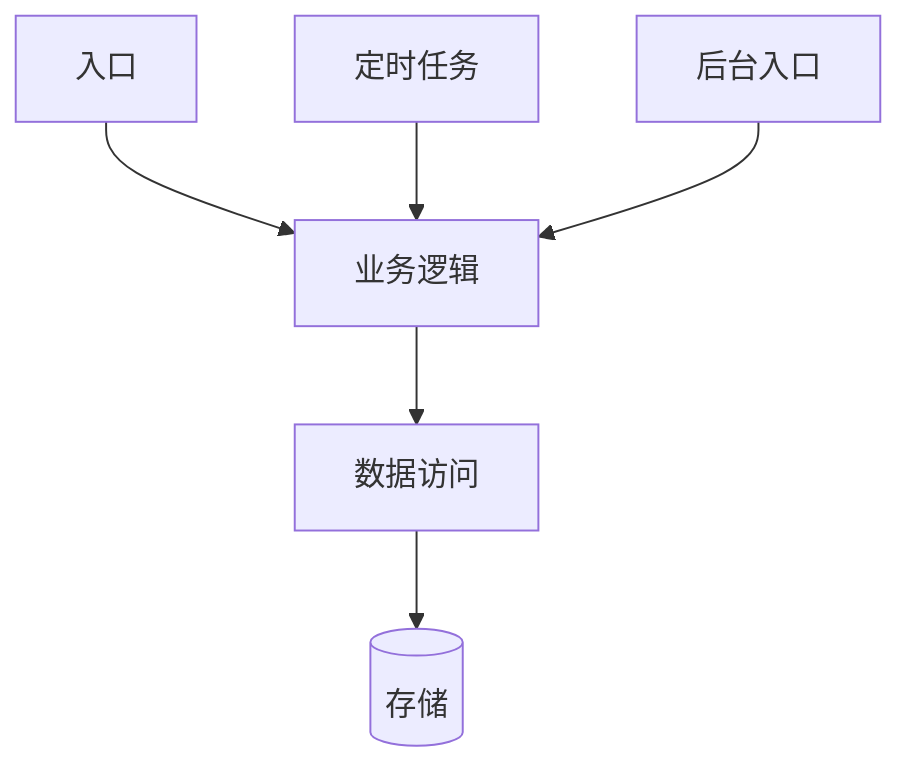
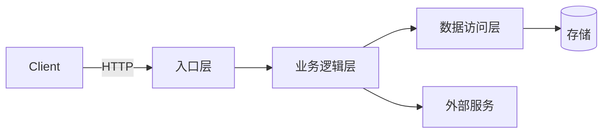

# open-understand — 代码理解

当变更涉及**已有代码**时，先对目标模块进行系统化代码理解，产出 `code-map.md`。帮助不熟悉老业务的程序员快速建立起对代码的心智模型。

## ⚡ 技能激活确认（必须执行）

你的第一条回复**必须完全输出**以下内容：

```
[open-understand v2.0] 代码理解 — 深度分析 + 结构化产出 code-map.md
[模块] <目标模块/功能>
[项目类型] <Java / Python / Frontend / Go / Node.js / Rust / Other>
```

输出此确认后，继续执行后续步骤。

## 前置

### 接受哪些输入

- 一个功能模块名（如"用户登录"、"订单导出"）
- 一个需求描述（AI 从中提取涉及模块）
- 一个或多个文件路径（直接指定入口文件）

### 执行要求

- 所有结论必须附代码出处（文件路径 + 行号）
- 产出独立于 spec.md 的 `code-map.md`，放在 `ai-work/changes/<变更名>/` 下
- 如果尚无 ai-work/changes/ 目录，放在 `ai-work/` 目录
- **根据检测到的项目类型，选择对应的层名、术语和模板示例**

---

## 执行步骤

### Step 1: 快速扫描 + 语言检测

1. 检测项目类型（复用 open-setup 的检测逻辑）
2. 执行 `tree -d -L 3`，建立整体目录感
3. 定位目标模块的核心目录结构

### Step 2: 全链路追踪（由外到内）

从**入口层**开始，逐层向内追踪到**存储层**。**根据项目类型使用对应的层名**：

#### 各项目类型的典型分层

| 项目类型 | 入口层 | 中间层 | 数据访问层 | 存储层 |
|---------|--------|--------|-----------|-------|
| **Java/Spring** | Controller | Service | DAO / Repository | DB / Redis |
| **Python FastAPI** | Router / Route | Service | Repository / Model | DB / Redis |
| **Python Django** | View / ViewSet | Serializer | Model / Manager | DB |
| **Frontend (React)** | Page / Component | Hook / Store | API Client | API / Cache |
| **Frontend (Vue)** | View / Page | Store / Composable | API Client | API / Cache |
| **Go** | Handler | Service | Repository / Store | DB |
| **Node.js Express** | Route / Middleware | Service / Controller | Model / DAO | DB |
| **Node.js NestJS** | Controller | Service | Repository / Prisma | DB |
| **Rust** | Handler | Service | Repository | DB |

**通用追踪模式（适配到对应语言）**：

```
入口层 (Controller / Route / Page / Handler)
  ↘ 校验/中间件 (Validator / Guard / Middleware)
    ↘ 业务逻辑层 (Service / UseCase / Hook / Store)
      ↘ 外部依赖调用 (External API / 其他模块)
        ↘ 数据访问层 (DAO / Repository / API Client / Model)
          ↘ 存储 (DB / Cache / 外部服务)
```

对于每个节点，记录：文件路径、函数/方法签名、核心逻辑摘要、行号。

**按项目类型搜索入口的方式**：

| 项目类型 | 搜索方式 |
|---------|---------|
| Java/Spring | 搜索 `@RequestMapping`, `@GetMapping`, `@PostMapping`, `@RestController` |
| Python FastAPI | 搜索 `@router.get`, `@router.post`, `@app.get`, `APIRouter` |
| Python Django | 搜索 `urlpatterns`, `path(`, `re_path(`, `as_view()` |
| Frontend | 搜索路由配置文件（`router.ts`, `routes.ts`, `next.config`）+ 页面组件 |
| Go | 搜索 `http.Handle`, `http.HandleFunc`, `gin.GET`, `echo.GET`, `fiber.Get` |
| Node.js Express | 搜索 `app.get(`, `app.post(`, `router.get(` |
| Node.js NestJS | 搜索 `@Controller`, `@Get`, `@Post` |
| Rust | 搜索 `.route(`, `get(`, `post(`, 路由宏 |

### Step 3: 逆向影响雷达

对 Step 2 中发现的每个核心函数/模型，**反向追踪谁依赖它们**：

- **Search callers**: 谁调用了这个函数？
- **Search consumers**: 谁引用了这个数据模型/组件？
- **Search config references**: 哪些配置项控制这个行为？

输出一个依赖树（语言无关）：



### Step 4: 变更耦合分析

使用 `git log` 分析目标文件的历史变更模式（语言无关）：

```
# 查看目标文件的历史变更
git log --oneline -- <文件路径>

# 查看最近 50 次提交中与目标文件同时变更的文件
```

输出：
- 经常一起变更的文件列表（高相关度）
- 曾经一起引入 Bug 的记录（如果有回滚或 fix commit）
- 说明"改这个模块通常还需要改什么"

### Step 5: 相似功能发现

如果需求是新功能但类似功能已存在：

1. 查找与需求描述匹配的已有功能
2. 提取该功能的完整结构作为模板（入口→业务逻辑→数据访问→存储）
3. 标注可复用部分和需修改部分

### Step 6: 测试契约提取

搜索与目标模块相关的测试文件（**根据项目类型使用对应的测试框架命名**）：

| 项目类型 | 测试文件模式 | 常见框架 |
|---------|------------|---------|
| Java | `*Test.java` | JUnit, TestNG, Mockito |
| Python | `test_*.py` / `*_test.py` | pytest, unittest |
| Frontend | `*.test.ts` / `*.spec.ts` / `*.test.tsx` | Vitest, Jest, Cypress |
| Go | `*_test.go` | go test, testify |
| Node.js | `*.test.ts` / `*.spec.ts` | Jest, Mocha, Vitest |

提取内容（语言无关）：

```
测试文件路径 | 测试用例名 | 验证的业务规则 | 边界条件
```

输出：
- 测试覆盖了哪些场景（正常/异常/边界）
- 测试未覆盖的区域（潜在风险）
- 与需求冲突的测试（如果需求变了）

### Step 7: 配置/常量标注

搜索与目标模块相关的所有配置项、常量、枚举、feature flag（**根据项目类型使用对应的搜索方式**）：

| 项目类型 | 配置格式 | 搜索方式 | 常量/枚举定义 |
|---------|---------|---------|-------------|
| Java/Spring | `application.yml`, `application.properties` | `@Value`, `@ConfigurationProperties`, 环境变量 | `enum`, `interface Constants`, `static final` |
| Python | `settings.py`, `config.py`, `.env`, `pyproject.toml` | `pydantic-settings`, `os.getenv`, `django.conf.settings` | `class Config`, `Enum`, 模块级常量 |
| Frontend | `.env`, `.env.development`, `vite.config`, `next.config` | `import.meta.env`, `process.env` | `const`, `enum` (TypeScript), 常量文件 |
| Go | `config.yaml`, `config.toml`, `.env` | `viper`, `os.Getenv`, `flag` | `const` 块, `iota` 枚举 |
| Node.js | `.env`, `config/` | `dotenv`, `@nestjs/config`, `process.env` | `const`, `enum` (TypeScript) |
| Rust | `config.toml`, `config.rs` | `dotenvy`, `config` crate, 环境变量 | `const`, `enum` |

标注"修改此功能时可能需要同步修改的配置"。

---

## 产出物: code-map.md

在 `ai-work/changes/<变更名>/code-map.md`（或 `ai-work/code-map.md`）输出。**code-map.md 的所有示例应匹配项目的实际语言**，以下是各章节的通用描述 + 按项目类型的示例对照。

```markdown
# Code Map — <模块名/功能名>

> 生成时间: YYYY-MM-DD
> 目标需求: <一句话描述>
> 项目类型: <类型>

---

## 1. 模块地图

（基于 tree -d 和扫描结果，标注模块职责）

**示例（根据实际项目类型选择类似风格）：**

```
# Java 风格
src/main/java/com/example/
  controller/       ← 入口层
  service/          ← 业务编排
  dao/              ← 数据访问
  model/            ← 数据模型

# Python 风格
app/
  routes/           ← 路由层
  services/         ← 业务逻辑
  models/           ← 数据模型
  core/             ← 配置/依赖

# Frontend 风格
src/
  pages/            ← 页面组件
  components/       ← 通用组件
  hooks/            ← 自定义 Hooks
  stores/           ← 状态管理
  api/              ← API 客户端

# Go 风格
internal/
  handler/          ← HTTP handler
  service/          ← 业务逻辑
  repository/       ← 数据访问
  model/            ← 数据模型
```

---

## 2. 架构概览

（Mermaid 组件关系图，使用项目实际层名）



---

## 3. 完整调用链路

### 链路: xxx 功能

| 步骤 | 文件 | 函数/方法 | 行号 | 职责 |
|------|------|-----------|------|------|
| 1 | （入口文件） | （入口函数） | Lxx | 参数校验 + 分发 |
| 2 | （业务文件） | （业务函数） | Lxx | 核心逻辑 |
| 3 | （数据文件） | （数据函数） | Lxx | 数据读写 |
| 4 | （业务文件） | （返回处理） | Lxx | 结果组装 |

（多条链路按功能分别列出）

---

## 4. 关键文件清单

| 文件 | 角色 | 风险等级 | 行数 |
|------|------|----------|------|
| （核心业务文件） | 核心业务逻辑 | 🔴 高 | xx |
| （数据访问文件） | 数据访问 | 🟡 中 | xx |
| （工具/辅助文件） | 辅助功能 | 🟢 低 | xx |

---

## 5. 数据模型

（根据实际项目类型选择对应的表示方式）

**关系型数据库（Java/Python/Go/Node.js）：**
```
表/集合: <表名>
  字段      类型       备注
  id       PK         自增
  name     VARCHAR     ...
```

**前端状态/类型（Frontend）：**
```
TypeScript Interface / Type:
  interface User {
    id: number
    name: string
    ...
  }

Store State:
  userStore: { currentUser, loading, error }
```

**枚举/常量定义：**
```
（按实际项目语言表示）
```

---

## 6. 变更耦合分析

| 本模块文件 | 常一同变更的文件 | 相关性 |
|-----------|----------------|--------|
| （核心文件） | （伴随文件1） | 🔴 高 |
| （核心文件） | （伴随文件2） | 🟡 中 |

---

## 7. 影响雷达

```
（入口函数）
  └── （业务函数）
        ├── （数据函数1）
        ├── （外部服务）
        └── （业务函数）也被以下调用:
              ├── （其他入口1）
              ├── （其他入口2）
              └── （间接调用）
```

---

## 8. 配置与常量

| 配置/常量 | 位置 | 说明 |
|-----------|------|------|
| （配置key） | （文件路径，行号） | 说明 |
| （常量名） | （文件路径，行号） | 说明 |

---

## 9. 测试契约

| 测试文件 | 用例名 | 验证规则 | 边界 |
|---------|--------|---------|------|
| （测试文件） | （用例名） | （验证内容） | （边界条件） |

---

## 10. 风险与模式

### 可复用模式

- （可复用的现有实现模式）

### 风险

1. （风险描述）
2. （风险描述）

---

## 附: Git 考古

| 文件 | 最近修改 | 主要修改者 | 历史提交数 | 关键 Commit |
|------|---------|-----------|-----------|------------|
| ... | ... | ... | ... | ... |
```

---

## 输出约束

1. **code-map.md 必须独立于 spec.md** — 是阅读理解产物，不是变更方案
2. **所有结论带出处** — 文件路径 + 行号
3. **不编造** — 分析不到的内容标注"待手动确认"或"超出静态分析范围"
4. **按需裁剪** — 上述模板是"全集"，可以只输出相关章节
5. **所有示例使用项目实际语言** — 别在 Python 项目里写 DAO/Controller，别在前端项目里写 Service/Entity
6. **如果项目没有 git 历史** — 跳过变更耦合分析和 git 考古章节
7. **输出位置** — `ai-work/changes/<变更名>/code-map.md`，若尚无 ai-work/changes/ 目录则放 `ai-work/code-map.md`

## 与 open-spec 的关系

- 对于**新功能**（greenfield）：直接走 `open-spec`，不必须跑此 skill
- 对于**老功能修改/追加**：建议先跑 `open-understand`，产出 `code-map.md`，再跑 `open-spec`
- `open-spec` 在 Research 阶段应读取 `code-map.md` 作为输入
